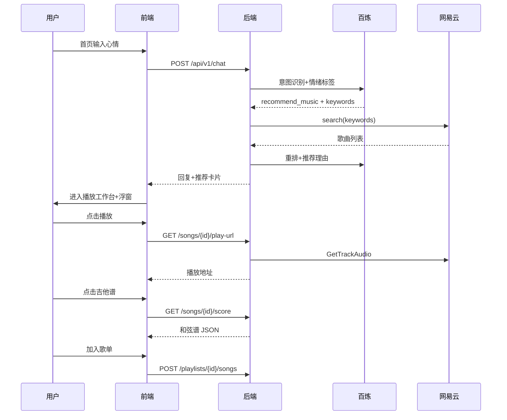
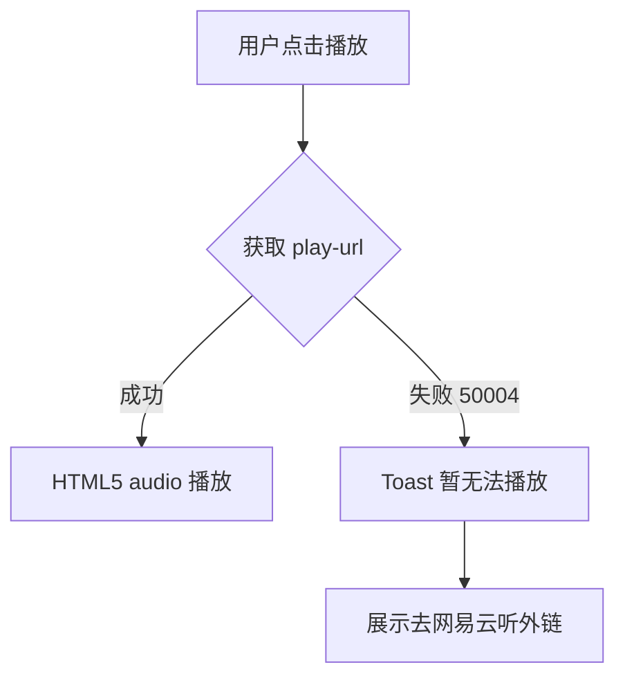

# AI 音乐陪伴助手 PRD

> 版本：阶段 C 定稿 | 项目：ai-music-companion | 更新：2026-06-07

---

## 1. 背景与调研结论

### 1.1 项目背景

用户在日常情绪波动时，希望获得音乐陪伴与可落地的弹唱体验。现有音乐 App 偏播放，弹唱谱平台偏工具，两者割裂。本产品以 **AI 情绪对话** 为入口，串联 **网易云曲库荐歌**、**应用内嵌播放**、**吉他/尤克里里弹唱谱** 与 **歌单管理**，形成「倾诉 → 荐歌 → 试听 → 看谱 → 收藏」闭环。

### 1.2 调研结论（阶段 R）

| 维度 | 结论 |
|------|------|
| 竞品参考 | musen（AI 对话荐歌）、MeloMo（情绪歌单）、AI音乐学园（弹唱教学）、audio2guitar（出谱工具） |
| 视觉方向 | **C 融合**：浅紫工作台；顶栏导航；首页 Hero；播放页双栏 + 聊天浮窗 |
| 技术栈 | 前端 React + TypeScript + Vite + Ant Design；后端 Python 3.11+ / FastAPI / PyCore |
| LLM | 阿里云百炼（DashScope），`qwen-plus`（对话/荐歌）、`qwen-turbo`（谱面辅助） |
| 曲库 | 网易云 API（pyncm 封装，搜索无需登录） |
| 用户体系 | **MVP 游客模式**（匿名 Session），网易云登录延后 V2 |

### 1.3 差异化定位

国内 Web 端 **「情绪 AI 陪伴 + 网易云曲库 + 双乐器弹唱谱 + 歌单」** 一体化产品。竞品要么有荐歌无谱，要么有谱无陪伴。

### 1.4 核心约束（MVP）

- 仅 Web 端，不做原生 App / 小程序
- 游客模式：无注册登录；数据绑定匿名 Session
- 网易云账号登录、每日推荐、导入网易云歌单 → V2
- 和弦谱 MVP 依赖缓存库 + 抓取，LLM 仅做排版/简化
- 开发环境 Python 需 3.11～3.13（pyncm 暂不支持 3.14）

---

## 2. 页面清单与跳转逻辑（A1）

### 2.1 页面清单

| 序号 | 页面名称 | 页面类型 | 可见角色 | 入口来源 | 跳转去向 |
|------|---------|---------|---------|---------|---------|
| P01 | 偏好引导页 | 向导页 | 游客（首次访问） | 直接访问（无偏好记录时） | P02 聊天首页 |
| P02 | 首页（发现） | 着陆页 | 游客 | 偏好引导完成 / 顶栏首页 | P02b 播放工作台 |
| P02b | 播放工作台 | 播放器页 | 游客 | P02 发送心情 / 点歌播放 | P03 谱面抽屉、G01 浮窗聊天 |
| P03 | 谱面详情页 | 详情页 | 游客 | P02 歌曲卡片 / P05 歌曲项 | P02、P04、P05 |
| P04 | 歌单列表页 | 列表页 | 游客 | 顶栏歌单 / P02 快捷入口 | P05 歌单详情 |
| P05 | 歌单详情页 | 详情页 | 游客 | P04 歌单卡片 | P03 谱面详情 |
| P06 | 我的页 | 设置页 | 游客 | 顶栏我的 | P01（重新设置偏好） |

### 2.2 全局布局

- **顶部导航**（全局）：首页 / 歌单 / 谱库 / 我的；右侧「AI 助手」+「游客模式」
- **P02 首页**：居中 Hero 心情输入 + 快捷标签；**默认不显示聊天浮窗**
- **P02b 播放工作台**：左「为您推荐」| 中黑胶播放器；内容区垂直居中
- **G01 聊天浮窗**：380×440px；播放页右侧垂直居中；可最小化/FAB 唤起
- **P03 谱面**：播放器「吉他谱/尤克里里谱」→ 右侧抽屉
- **P04/P05 歌单**：列表页；歌曲可进入播放工作台
- **P01 偏好引导**：首次访问弹层向导

### 2.3 页面跳转图

```text
首次访问 → P01 偏好引导 → P02 首页
                              ├─发送心情 → P02b 播放工作台 + G01 浮窗
                              ├─顶栏歌单 → P04 歌单列表 → P05 歌单详情 → P02b / P03
                              └─顶栏我的 → P06 → 修改偏好 / 清除数据
```

---

## 3. 主要功能定义与分析（A2）

### 3.1 页面：P01 偏好引导页

#### 功能清单

| 功能编号 | 功能名称 | 一句话描述 | 用户可感知的完成标准 |
|---------|---------|-----------|-------------------|
| F-01-01 | 弹唱水平选择 | 选择零基础/入门/进阶 | 选中一项后可进入下一步 |
| F-01-02 | 风格偏好选择 | 多选喜欢的音乐风格（民谣/摇滚/流行等） | 至少选 1 项后可完成引导 |
| F-01-03 | 保存偏好 | 将偏好写入游客 Session | 完成后自动进入聊天首页，下次访问不再显示引导 |

#### 功能边界

| 功能编号 | 包含 | 不包含 |
|---------|------|--------|
| F-01-01 | 三档水平单选 | 技能测评、AI 评测 |
| F-01-02 | 预设风格标签多选（≥6 个） | 自定义风格输入 |
| F-01-03 | 存服务端 + Cookie Session | 跨设备同步 |

---

### 3.2 页面：P02 聊天首页

#### 功能清单

| 功能编号 | 功能名称 | 一句话描述 | 用户可感知的完成标准 |
|---------|---------|-----------|-------------------|
| F-02-01 | AI 情绪对话 | 多轮聊天，AI 共情回应 | 发送消息后收到 AI 回复气泡 |
| F-02-02 | 智能荐歌 | 识别荐歌意图后展示推荐歌曲卡片 | 卡片含封面、歌名、歌手、推荐理由 |
| F-02-03 | 查看谱面 | 从推荐卡片进入谱面详情 | 点击「看谱」跳转 P03 |
| F-02-04 | 收藏到歌单 | 将歌曲加入指定歌单 | 点击「收藏」弹出歌单选择，成功后 Toast 提示 |
| F-02-05 | 历史会话 | 查看本次 Session 内的对话记录 | 页面加载后展示历史消息（同 Session） |
| F-02-06 | 新建对话 | 清空当前对话上下文 | 点击后对话区清空，可开始新话题 |
| F-02-07 | 卡片内嵌播放 | 从推荐卡片直接播放歌曲 | 点击封面/播放按钮，底部迷你播放器开始播放 |

#### 功能边界

| 功能编号 | 包含 | 不包含 |
|---------|------|--------|
| F-02-01 | 文本输入、多轮上下文、共情话术 | 语音/图片输入、流式打字（V1 可选） |
| F-02-02 | 情绪+风格标签 → 网易云搜索 → LLM 重排 | 每日推荐、个性化模型训练 |
| F-02-03 | 跳转 P03 并传递 song_id | 页内嵌谱面预览 |
| F-02-04 | 选择已有歌单或新建歌单后添加 | 自动加歌单（须用户确认） |
| F-02-05 | 当前 Session 消息持久化 | 跨 Session 历史、搜索 |
| F-02-06 | 重置对话上下文 | 删除历史记录 |
| F-02-07 | 触发全局播放器、展示加载/失败状态 | 自动连播推荐列表 |

#### 页面关联

- F-02-03 → P03 谱面详情（携带 `song_id`）
- F-02-04 → 写入歌单（P04/P05 可见）

---

### 3.3 页面：P03 谱面详情页

#### 功能清单

| 功能编号 | 功能名称 | 一句话描述 | 用户可感知的完成标准 |
|---------|---------|-----------|-------------------|
| F-03-01 | 歌曲信息展示 | 展示歌名、歌手、封面 | 进入页面即看到歌曲基本信息 |
| F-03-02 | 吉他谱展示 | 展示吉他和弦+歌词对齐谱 | 默认 Tab 为吉他，和弦与歌词清晰可读 |
| F-03-03 | 尤克里里谱展示 | 展示尤克里里和弦+歌词谱 | 切换 Tab 后显示尤克里里版本 |
| F-03-04 | 水平适配 | 按用户水平简化和弦 | 零基础用户看到简化版和弦 |
| F-03-05 | 收藏到歌单 | 将当前歌曲加入歌单 | 同 F-02-04 |
| F-03-06 | 内嵌播放 | 在应用内播放当前歌曲 | 顶部播放区或迷你播放器可播放/暂停，边听边看谱 |
| F-03-07 | 播放失败兜底 | 无法获取播放地址时的降级 | 提示「暂无法播放」并提供「去网易云听」外链 |

#### 功能边界

| 功能编号 | 包含 | 不包含 |
|---------|------|--------|
| F-03-01 | 基础元数据 | 专辑详情、评论 |
| F-03-02 | 和弦名 + 歌词行对齐 | 六线谱、指法动画 |
| F-03-03 | 尤克里里和弦转换 | 其他乐器 |
| F-03-04 | 按水平过滤复杂和弦 | 自动转调、Capo 建议（V2） |
| F-03-05 | 手动选择歌单添加 | 自动收藏 |
| F-03-06 | HTML5 内嵌播放、播放/暂停、进度条 | 歌词滚动同步、MV 视频 |
| F-03-07 | 外链 `music.163.com` 作为兜底 | — |

---

### 3.4 页面：P04 歌单列表页

#### 功能清单

| 功能编号 | 功能名称 | 一句话描述 | 用户可感知的完成标准 |
|---------|---------|-----------|-------------------|
| F-04-01 | 歌单列表 | 展示当前游客的所有歌单 | 卡片显示歌单名、歌曲数、封面 |
| F-04-02 | 创建歌单 | 新建空歌单 | 输入名称后列表出现新歌单 |
| F-04-03 | 删除歌单 | 删除指定歌单 | 确认后歌单从列表消失 |
| F-04-04 | 进入歌单详情 | 点击歌单卡片 | 跳转 P05 |

#### 功能边界

| 功能编号 | 包含 | 不包含 |
|---------|------|--------|
| F-04-01 | 按更新时间倒序 | 搜索、排序、分享 |
| F-04-02 | 名称 + 可选描述 | 封面自定义上传 |
| F-04-03 | 二次确认删除 | 批量删除 |
| F-04-04 | 跳转 P05 | — |

---

### 3.5 页面：P05 歌单详情页

#### 功能清单

| 功能编号 | 功能名称 | 一句话描述 | 用户可感知的完成标准 |
|---------|---------|-----------|-------------------|
| F-05-01 | 歌曲列表 | 展示歌单内所有歌曲 | 列表含歌名、歌手、添加时间 |
| F-05-02 | 移除歌曲 | 从歌单移除指定歌曲 | 确认后歌曲从列表消失 |
| F-05-03 | 查看谱面 | 点击歌曲进入谱面 | 跳转 P03 |
| F-05-04 | 编辑歌单信息 | 修改歌单名称/描述 | 保存后列表同步更新 |
| F-05-05 | 歌单内播放 | 从歌单列表播放指定歌曲 | 点击播放图标，迷你播放器加载该曲 |

#### 功能边界

| 功能编号 | 包含 | 不包含 |
|---------|------|--------|
| F-05-01 | 歌曲基础信息展示 | 拖拽排序（V2） |
| F-05-02 | 单首移除 | 批量移除 |
| F-05-03 | 跳转 P03 | — |
| F-05-04 | 名称、描述编辑 | 封面上传 |
| F-05-05 | 单曲播放 | 歌单连播、随机播放（V2） |

---

### 3.7 全局组件：G01 迷你播放器

#### 功能清单

| 功能编号 | 功能名称 | 一句话描述 | 用户可感知的完成标准 |
|---------|---------|-----------|-------------------|
| G01-01 | 播放控制 | 播放/暂停当前歌曲 | 底部栏显示封面、歌名、歌手与播放按钮 |
| G01-02 | 进度展示 | 展示播放进度 | 进度条可拖动 seek（MVP 可选简化） |
| G01-03 | 跨页保持 | 切换 Tab/页面不中断播放 | 从聊天切到歌单，音乐继续播放 |
| G01-04 | 关闭播放 | 关闭当前播放 | 点击关闭后迷你播放器收起 |
| G01-05 | 跳转谱面 | 从播放器进入当前歌曲谱面 | 点击歌曲信息区跳转 P03 |

#### 功能边界

| 功能编号 | 包含 | 不包含 |
|---------|------|--------|
| G01-01 | 播放/暂停、Loading 状态 | 上一首/下一首（V2 歌单连播） |
| G01-02 | 当前时间 / 总时长展示 | 歌词滚动 |
| G01-03 | 全局单例播放器状态 | 后台播放（页面关闭即停止） |
| G01-04 | 停止并隐藏播放器 | — |
| G01-05 | 携带当前 `song_id` 跳转 | — |

---

### 3.6 页面：P06 我的页

#### 功能清单

| 功能编号 | 功能名称 | 一句话描述 | 用户可感知的完成标准 |
|---------|---------|-----------|-------------------|
| F-06-01 | 偏好查看/修改 | 查看并修改弹唱水平与风格 | 修改后保存成功 Toast |
| F-06-02 | 游客说明 | 展示游客模式数据说明 | 页面可见「清除 Cookie 后数据丢失」提示 |
| F-06-03 | 清除数据 | 清除当前游客全部数据 | 确认后歌单/对话/偏好全部清空，回到 P01 |

#### 功能边界

| 功能编号 | 包含 | 不包含 |
|---------|------|--------|
| F-06-01 | 水平单选、风格多选 | 账号绑定 |
| F-06-02 | 静态说明文案 | — |
| F-06-03 | 删除 Session 关联全部数据 | 部分清除 |

---

## 4. Mission、Persona、版本规划（A3）

### 4.1 Mission

让每一次情绪波动，都能被音乐温柔接住，并落到可弹唱的行动上。

### 4.2 Persona

| 角色 | 描述 | 核心诉求 |
|------|------|----------|
| 小悠 | 22 岁，职场新人，会几个吉他和弦 | 下班后想弹唱放松，需要适合心情的歌和简单谱 |
| 阿凯 | 28 岁，尤克里里初学者 | 想快速找到能弹的歌，不想在多个 App 间切换 |
| 晚风 | 30 岁，情绪敏感型用户 | 先倾诉再听歌，希望 AI 理解自己而非机械推荐 |

### 4.3 V1 / MVP

| 页面 | 包含功能 | 排除功能 | 理由 |
|------|---------|---------|------|
| P01 | F-01-01~03 | 账号绑定 | 游客模式降低门槛 |
| P02 | F-02-01~07 + G01 | 流式输出、语音、自动连播 | 核心闭环优先 |
| P03 | F-03-01~07 + G01 | 转调/Capo、指法动画、歌词同步 | 谱面数据源复杂，先基础展示 |
| P04 | F-04-01~04 + G01 | 导出、分享 | 非核心 |
| P05 | F-05-01~05 + G01 | 拖拽排序、歌单连播 | 单曲播放优先 |
| P06 | F-06-01~03 | 账号升级入口 | V2 再做 |

### 4.4 V2+

| 功能 | 预计版本 | 延后理由 |
|------|---------|---------|
| 网易云账号登录（扫码） | V1.1 | 需改造 pyncm 多用户 Cookie 管理 |
| 导入网易云歌单 / 每日推荐 | V1.1 | 依赖账号登录 |
| 转调 / Capo 建议 | V1.2 | 谱面算法复杂度 |
| AI 弹唱练习计划 | V1.3 | 依赖稳定谱面质量 |
| 歌单导出 / 分享 | V1.2 | 非核心 |
| 对话流式输出 | V1.1 | 体验优化 |
| 歌单连播 / 上一首下一首 | V1.2 | 依赖播放器状态机完善 |
| 歌词滚动同步 | V1.2 | 需歌词时间轴数据 |
| 注册登录（产品自有账号） | V2.0 | 游客验证后再做 |

### 4.5 关键业务规则

1. **游客 Session**：首次访问生成 `guest_id`，写入 HttpOnly Cookie；有效期 30 天
2. **荐歌须确认**：AI 推荐歌曲后，收藏/加歌单必须用户点击确认
3. **谱面缓存**：按 `song_id + instrument + skill_level` 缓存，避免重复生成
4. **情绪兜底**：检测到极端负面情绪时，AI 优先关怀话术，不强行推歌
5. **清 Cookie = 丢数据**：游客模式下数据不可恢复，须在 P06 明确告知
6. **播放地址时效**：网易云播放 URL 有时效，后端按需获取，前端失败时走 F-03-07 兜底外链
7. **单例播放**：全局同时只播放一首；切换歌曲时停止上一首
8. **不自动播放**：须用户点击播放按钮后才开始（遵守浏览器自动播放策略）

---

## 5. 复杂功能业务链路 + 关键实现思路（A4）

### 5.1 链路：情绪对话荐歌（P02）

- **触发场景**：用户在聊天框输入心情或荐歌请求
- **实现思路**：
  1. LLM 意图分类：`chat_only` / `recommend_music`
  2. 若为 `recommend_music`：LLM 抽取情绪标签 + 风格标签 + 搜索关键词
  3. 调用 `NeteaseMusicProvider.search(keyword)` 召回 10～20 首
  4. LLM 重排 Top 5，输出结构化 JSON：`[{song_id, reason}]`
  5. 前端渲染推荐卡片嵌入对话流
- **关键技术选型**：百炼 `qwen-plus`；网易云 pyncm 搜索（无需登录）
- **待确认**：百炼 API Key（用户提供）

### 5.2 链路：弹唱谱生成（P03）

- **触发场景**：用户进入谱面详情页
- **实现思路**：
  1. 查 `chord_cache` 表（`song_id`）
  2. 未命中 → `ChordProvider.fetch(song_name, artist)` 抓取和弦序列
  3. LLM（`qwen-turbo`）按用户 `skill_level` 简化和弦
  4. 分别渲染吉他版 / 尤克里里版（和弦转换规则）
  5. 写入缓存
- **关键技术选型**：和弦库抓取 + 规则转换；LLM 仅辅助简化与排版
- **待确认**：和弦数据源 MVP 策略（抓取 UG 类站点 / Mock 种子数据）

### 5.3 链路：应用内嵌播放（G01 / P02 / P03 / P05）

- **触发场景**：用户点击推荐卡片、谱面页或歌单行的播放按钮
- **实现思路**：
  1. 前端调用 `GET /api/v1/songs/{netease_song_id}/play-url`
  2. 后端通过 pyncm `GetTrackAudio` / `GetTrackDownloadURL` 获取可播放地址（标准音质）
  3. 若直链有 CORS 限制 → 后端 `GET /api/v1/songs/{id}/stream` 代理音频流
  4. 前端全局 `PlayerStore`（单例）驱动 HTML5 `<audio>`，迷你播放器展示状态
  5. 获取失败 → Toast 提示 + 展示「去网易云听」外链（F-03-07）
- **关键技术选型**：pyncm 播放 API；FastAPI 流式代理（按需）；前端 Zustand/Context 全局状态
- **游客模式限制**：部分 VIP/独家曲目可能无法获取播放地址，须明确提示并降级外链
- **待确认**：无（MVP 纳入）

### 5.4 链路：游客歌单管理（P04/P05）

- **触发场景**：用户创建歌单或收藏歌曲
- **实现思路**：所有 CRUD 操作带 `guest_id` 过滤；歌曲元数据存 `netease_song_id` + 冗余 name/artist/cover
- **关键技术选型**：PostgreSQL；无外键到网易云
- **待确认**：无

### 5.5 AI 功能章节

#### AI 参与功能

| 功能 | AI 职责 | 模型 |
|------|---------|------|
| 情绪对话 | 共情回复、意图识别 | qwen-plus |
| 智能荐歌 | 标签抽取、重排、推荐理由 | qwen-plus |
| 谱面辅助 | 和弦简化、练习提示（MVP 轻量） | qwen-turbo |

#### 默认意图分类

- `chat_only`：纯倾诉，不推歌
- `recommend_music`：明确或隐含荐歌需求
- `view_score`：查看谱面（可由前端路由处理，不经 LLM）
- `manage_playlist`：歌单操作（前端+API 处理）

#### 默认提示词方向

- 情绪教练：温暖、简短、不评判；极端情绪时建议关怀资源
- 荐曲师：必须输出 JSON 结构；每首歌附 1 句推荐理由
- 谱师：不编造和弦；仅对已有和弦做简化说明

#### 智能边界

| 类型 | 规则 |
|------|------|
| 可自动执行 | 网易云搜索召回 |
| 须用户确认 | 收藏歌曲、加入歌单、生成谱面（点击进入） |
| 须追问 | 荐歌意图不明确时询问心情或风格 |
| 须拒绝/关怀 | 自伤/极端负面情绪 → 关怀话术，不推荐欢快歌曲 |

#### 材料状态

- 提示词/意图体系：**未提供，使用上述默认配置**
- 后续可替换：Prompt 模板、意图枚举、模型选择

---

## 6. 数据契约确认清单（A5）

### 6.1 业务数据契约

#### 游客 Session

- [ ] `guest_id`（UUID，主键）
- [ ] `created_at`（datetime）
- [ ] `last_active_at`（datetime）
- [ ] `skill_level`（枚举：`beginner` / `intermediate` / `advanced`）
- [ ] `style_preferences`（string[]，风格标签列表）

#### 对话消息（chat_message）

- [ ] `id`（UUID）
- [ ] `guest_id`（FK）
- [ ] `role`（枚举：`user` / `assistant`）
- [ ] `content`（text）
- [ ] `metadata`（JSON，可选：推荐卡片 `recommendations: [{song_id, reason}]`）
- [ ] `created_at`（datetime）

#### 歌单（playlist）

- [ ] `id`（UUID）
- [ ] `guest_id`（FK）
- [ ] `name`（string，1～50 字）
- [ ] `description`（string，可选，0～200 字）
- [ ] `cover_url`（string，可选，默认歌曲封面或占位图）
- [ ] `created_at` / `updated_at`（datetime）

#### 歌单歌曲（playlist_song）

- [ ] `id`（UUID）
- [ ] `playlist_id`（FK）
- [ ] `netease_song_id`（int）
- [ ] `song_name`（string）
- [ ] `artist_name`（string）
- [ ] `cover_url`（string，可选）
- [ ] `added_at`（datetime）
- [ ] 唯一约束：`(playlist_id, netease_song_id)`

#### 和弦缓存（chord_cache）

- [ ] `id`（UUID）
- [ ] `netease_song_id`（int，唯一）
- [ ] `song_name` / `artist_name`（string）
- [ ] `key`（string，原调，如 `C`）
- [ ] `chords`（JSON，`[{position, chord, lyric_line}]`）
- [ ] `source`（枚举：`crawled` / `manual` / `mock`）
- [ ] `created_at` / `updated_at`（datetime）

#### 谱面渲染缓存（score_cache）

- [ ] `id`（UUID）
- [ ] `netease_song_id`（int）
- [ ] `instrument`（枚举：`guitar` / `ukulele`）
- [ ] `skill_level`（枚举，同 guest）
- [ ] `rendered_score`（JSON，渲染后的和弦+歌词结构）
- [ ] 唯一约束：`(netease_song_id, instrument, skill_level)`

### 6.2 接口响应格式契约

#### 统一响应格式

- [ ] 成功：`{"code": 200, "message": "success", "data": { ... }}`
- [ ] 错误：`{"code": <错误码>, "message": "<错误描述>", "data": null}`
- [ ] 分页：`{"code": 200, "message": "success", "data": {"items": [...], "total": 100, "page": 1, "page_size": 20}}`

#### HTTP 状态码约定

- [ ] 200：成功
- [ ] 400：参数错误
- [ ] 401：Session 无效或过期
- [ ] 404：资源不存在
- [ ] 500：服务器内部错误

#### 业务错误码（code 字段）

- [ ] `40001`：参数校验失败
- [ ] `40101`：游客 Session 无效
- [ ] `40401`：歌单不存在
- [ ] `40402`：歌曲不存在
- [ ] `40403`：谱面暂无数据
- [ ] `50001`：LLM 调用失败
- [ ] `50002`：网易云 API 调用失败
- [ ] `50003`：和弦数据源失败
- [ ] `50004`：播放地址获取失败

#### 播放相关 API（初稿）

- [ ] `GET /api/v1/songs/{netease_song_id}/play-url` → `{url, expires_in, quality}`
- [ ] `GET /api/v1/songs/{netease_song_id}/stream` → `audio/mpeg` 流式代理（CORS 兜底）

---

## 7. 外部依赖与配置草稿（A5-3）

| 依赖 | 用途 | 关键配置字段 | Key/账号来源 | 存放位置 | 缺失时策略 | 状态 |
|------|------|-------------|-------------|----------|-----------|------|
| LLM 百炼 DashScope | 情绪对话、荐歌重排、谱面简化 | `DASHSCOPE_API_KEY` `LLM_MODEL_CHAT=qwen-plus` `LLM_MODEL_SCORE=qwen-turbo` | 用户提供测试 Key | `backend/.env` | Mock 固定回复，荐歌返回种子歌曲 | **✅ Key 已提供（仅存 .env）** |
| 网易云 API（pyncm） | 歌曲搜索、元数据 | 无 Key（非官方开放平台） | 无需 | — | 返回 Mock 歌曲列表 | 已确认使用 |
| PostgreSQL | 业务数据持久化 | `DATABASE_URL` | 本地/Dev 自建 | `backend/.env` | SQLite 降级（仅 Dev） | 待部署确认 |
| 和弦数据源 | 弹唱谱 Mock / 抓取 | `CHORD_PROVIDER=mock` | 无需 Key | 配置项 | Mock 和弦种子数据 | **✅ MVP 使用 Mock** |
| Embedding | 无 | — | — | — | 无 | 无 |
| Rerank | 无（MVP LLM 直接重排） | — | — | — | 无 | 无 |
| 对象存储 | 无（封面用网易云 CDN URL） | — | — | — | 无 | 无 |
| 第三方登录 / OAuth | V2 网易云扫码 | `NETEASE_COOKIE_ENCRYPTION_KEY` | V2 再做 | `backend/.env` | 跳过 | V2 |
| 支付 / 短信 / 邮件 | 无 | — | — | — | 无 | 无 |

### 用户确认记录

| 项 | 确认状态 | 备注 |
|----|----------|------|
| 视觉方向 C 融合 | ✅ 已确认 | 2026-06-07 |
| AI 默认配置 | ✅ 已确认 | 百炼 + 上述边界 |
| 游客模式 MVP | ✅ 已确认 | 无登录 |
| 阶段 A 总确认 | ✅ 已确认 | 2026-06-07 |
| 百炼 API Key | ✅ 已提供 | 仅存 `backend/.env`，不入库 |
| 和弦数据源 | ✅ Mock | `CHORD_PROVIDER=mock` |
| PostgreSQL 部署 | ⏳ 待确认 | Dev 默认 SQLite |
| 阶段 B2 原型 | ✅ 已确认 | `docs/prototypes/index.html` |
| 阶段 C 定稿 | ✅ 已确认 | 2026-06-07 |

---

## 8. 非功能需求

| 维度 | MVP 目标 |
|------|----------|
| 性能 | 荐歌链路 P95 < 8s；谱面页加载 P95 < 5s（含缓存命中） |
| 兼容 | Chrome / Safari / Edge 最新两个大版本 |
| 安全 | 游客 Cookie HttpOnly；`.env` 不入库；和弦抓取遵守 robots |
| 可访问性 | 基础键盘导航；谱面区足够对比度 |

---

## 9. 路线图（终版）

| 版本 | 范围 | 里程碑 |
|------|------|--------|
| **V1 MVP** | 游客模式、首页荐歌、播放工作台、内嵌播放、Mock 和弦谱、歌单 CRUD、聊天浮窗 | 可演示完整闭环 |
| V1.1 | 网易云登录、每日推荐、对话流式输出 | 个性化增强 |
| V1.2 | 转调/Capo、歌单连播、歌词同步、和弦抓取 | 弹唱深度 |
| V1.3 | AI 练习计划 | 教学延伸 |
| V2.0 | 自有账号体系、歌单导出分享 | 产品化 |

---

## 10. 技术架构蓝图

### 10.1 技术选型

| 层级 | 选型 | 说明 |
|------|------|------|
| 前端 | React 18 + TypeScript + Vite | 桌面 Web |
| UI | Ant Design 5 | 对齐原型色板（主色 `#6B4EFF`） |
| 状态 | Zustand | 播放器单例、聊天浮窗、游客偏好 |
| 请求 | Axios | 统一拦截器 + Cookie 携带 |
| 后端 | Python 3.11～3.13 + FastAPI + PyCore | 禁止重写 server/config 脚手架 |
| ORM | SQLAlchemy 2.x | Dev 默认 SQLite |
| LLM | 百炼 DashScope | qwen-plus / qwen-turbo |
| 曲库 | pyncm 封装 | 搜索、播放 URL |
| 和弦 | ChordProvider Mock | `CHORD_PROVIDER=mock` |

### 10.2 分层架构

```text
frontend/          React 页面 + Zustand stores + services
backend/src/
  api/routes/      FastAPI 路由
  services/        业务服务（chat, music, score, playlist）
  integrations/    NeteaseProvider, DashScopeLLM, ChordProvider
  models/          SQLAlchemy 模型
pycore/            框架脚手架（Config, Server, DB）
```

### 10.3 部署方案（Dev）

```text
前端：npm run dev → localhost:5173（Vite 代理 /api → 8000）
后端：uvicorn → localhost:8000
数据：SQLite backend/data/app.db
配置：backend/.env（不入库）
```

---

## 11. 原型说明

| 原型文件 | 对应 PRD 页面 |
|---------|--------------|
| `docs/prototypes/index.html` | P01 弹层、P02 首页、P02b 播放页、P03 谱面抽屉、P04/P05 歌单、P06 我的、G01 浮窗 |
| `docs/prototypes/assets/style.css` | 视觉 token、动效规范 |
| `docs/prototypes/assets/app.js` | Mock 交互状态机 |
| `docs/prototypes/README.md` | 交接说明 |

**原型与生产差异（须在实现时处理）：**

- 原型为单文件 HTML；生产为 React 组件化
- 黑胶视觉可简化为封面 + 标准播放控件
- 原型 Mock 歌曲数据；生产接真实 API

---

## 12. 核心流程图

### 12.1 主流程：心情荐歌 → 播放 → 看谱 → 收藏



### 12.2 异常分支：播放失败兜底



---

## 13. 组件交互与模块划分

### 13.1 前端模块

| 模块 | 职责 | 依赖 |
|------|------|------|
| `layouts/AppLayout` | 顶栏导航、游客徽章 | react-router |
| `pages/HomePage` | Hero 心情输入 | chatService |
| `pages/PlayerPage` | 推荐列表+播放器 | playerStore, musicService |
| `components/ChatFloat` | 聊天浮窗 | chatStore, chatService |
| `components/ScoreDrawer` | 谱面抽屉 | scoreService |
| `stores/playerStore` | 全局播放状态 | musicService |
| `pages/PlaylistPage` | 歌单 CRUD | playlistService |

### 13.2 后端模块

| 模块 | 职责 |
|------|------|
| `guest_service` | Session 创建、偏好读写、数据清除 |
| `chat_service` | 对话持久化、LLM 编排、荐歌 |
| `music_provider` | 网易云搜索、元数据、播放 URL |
| `score_service` | 和弦缓存、Mock/抓取、水平简化 |
| `playlist_service` | 歌单 CRUD |

### 13.3 技术风险与缓解

| 风险 | 影响 | 缓解 |
|------|------|------|
| pyncm 不支持 Python 3.14 | 后端无法启动 | 锁定 3.11～3.13 虚拟环境 |
| 网易云播放 URL 失效/CORS | 无法内嵌播放 | 后端 stream 代理 + 外链兜底 |
| VIP 歌曲无播放权限 | 游客播放失败 | 明确错误码 + 外链 |
| 和弦 Mock 覆盖有限 | 部分歌曲无谱 | MVP 接受；V1.2 接抓取 |
| LLM 荐歌幻觉 | 推荐不准确 | 必须基于搜索召回后重排，禁止凭空造歌 |
